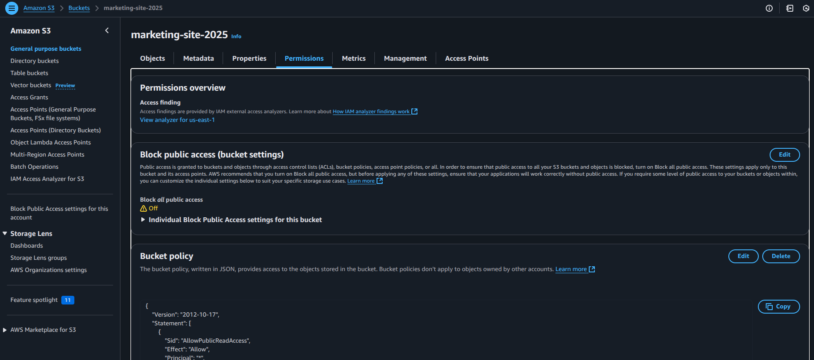
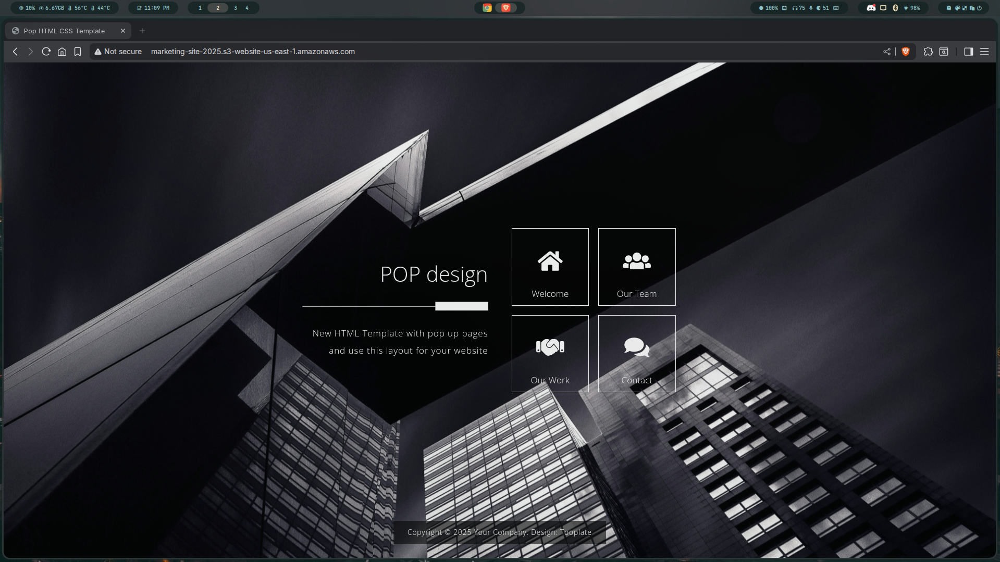

# 🌐 Deploy a Static Website on AWS S3 + CloudFront

This guide walks through deploying a static website globally using **Amazon S3** and **CloudFront**, ideal for company marketing sites, portfolios, or any static content. This documentation is created with AWS Free Tier in mind — no domain required.

---

## 📋 Prerequisites

* AWS account (Free Tier is sufficient)
* Basic static website files (HTML, CSS, JS)
* Internet connection and web browser
* Optional: AWS CLI installed for advanced automation

---

## 🪜 Step-by-Step Deployment

### 1️⃣ Upload Files to S3 Bucket

* Open AWS S3 Console
* Create a new bucket (e.g., `my-static-site-demo`)
* Uncheck "Block all public access" and acknowledge the warning
* Upload your `index.html`, stylesheets, scripts, etc.

**Screenshot:**


---

### 2️⃣ Enable Static Website Hosting

* Go to **Properties** tab of the bucket
* Scroll to **Static Website Hosting** section
* Enable it and set:

  * **Index document**: `index.html`
  * **Error document**: leave blank or set `error.html`
* Save changes

**Screenshot:**


---

### 3️⃣ Add Bucket Policy for Public Access

* Go to **Permissions** tab > **Bucket Policy**
* Paste the policy below (replace `your-bucket-name`):

```json
{
  "Version": "2012-10-17",
  "Statement": [
    {
      "Sid": "PublicReadGetObject",
      "Effect": "Allow",
      "Principal": "*",
      "Action": "s3:GetObject",
      "Resource": "arn:aws:s3:::your-bucket-name/*"
    }
  ]
}
````

**Screenshot:**


---

### 4️⃣ Create CloudFront Distribution

* Open **CloudFront Console**
* Click **Create Distribution**
* Set the origin domain to your **S3 bucket website endpoint** (not the S3 REST API URL)
* Leave defaults or configure caching and price class as needed
* Save and deploy

> ⚠️ **Note:** It may take a few minutes to propagate changes.

**Screenshot:**


---

### 5️⃣ Preview the Website

* Open the CloudFront distribution domain name (e.g., `dxxxxxxx.cloudfront.net`)
* Your static website should load properly

**Screenshot:**


---

## 📂 Directory Structure

```
aws-static-site-deployment/
├── images/
│   ├── bucket-policy.png
│   ├── CloudFront Distribution.png
│   ├── S3 uploaded files.png
│   ├── S3 website hostinh setting.png
│   └── site-preview.png
├── site/
│   └── index.html (your actual website files)
└── README.md
```

---

## ✅ Optional Improvements

* Add a custom domain via Route 53 and attach SSL using ACM
* Automate deployment using AWS CLI or GitHub Actions
* Monitor usage with AWS CloudWatch

---

## 📸 Image Showcase (Quick Reference)

### ✅ S3 Uploaded Files


---

### ✅ S3 Website Hosting Settings


---

### ✅ Bucket Policy


---

### ✅ CloudFront Distribution


---

### ✅ Site Preview


---

